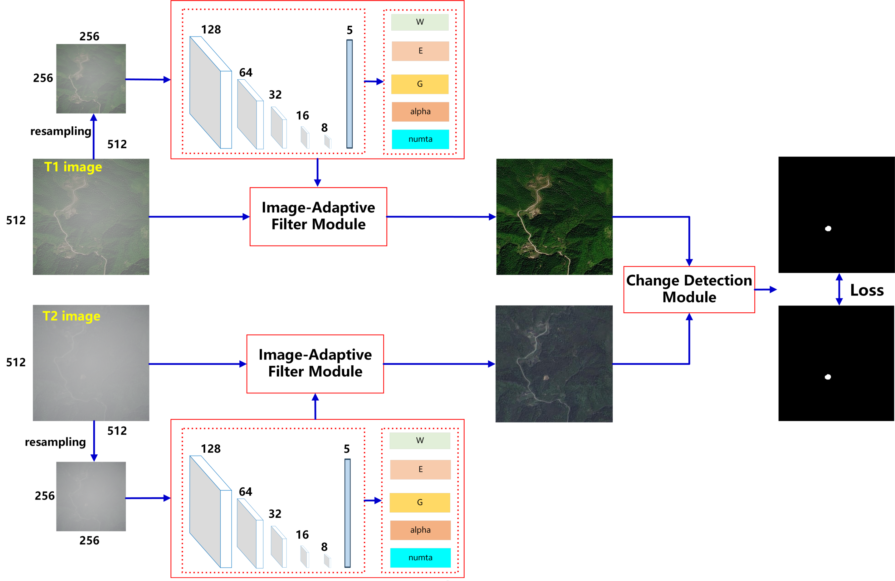
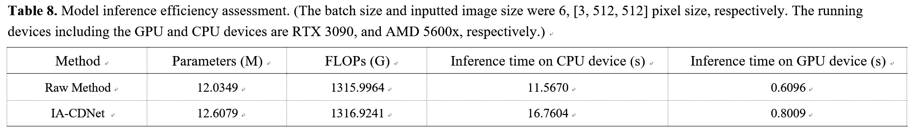
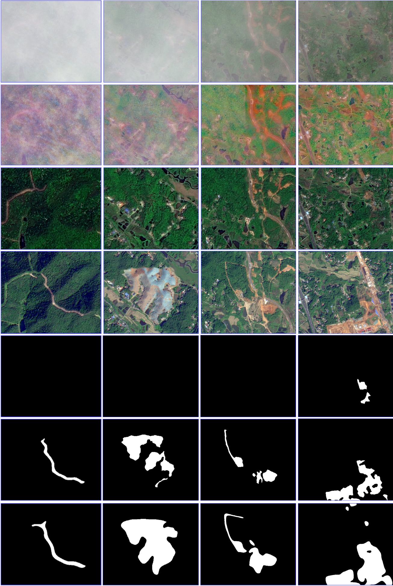

## Robust Remote Sensing Change Detection in Adverse Conditions with An Image-Adaptive Method


### module structure
- the module structure of IA-CDNet is as follow:
  

- Module file
```python
module\model.py:   the main model file of IA-CDNet.
```

### performance
- The parameter of IA-CDNet is 12.6079 M, several key point of this module is as follows:


- The performance of IA-CDNet in real-world can be seen as follows:


### Usage
- Before running IA-CDNet, several third-party libraries should be installed:
```python
torch
torchvision
opencv-python
thop
easydict
scikit-image
```
- To test IA-CDNet, just use following script:
```python
python Parameter.py
```

- The image with adverse image conditions through the IA-CDNet can be seen as follows:


### reference
```python
Author:  Wang Z, Wang Z, Tang X, Zhang Q, et al. 
Title:   Robust Remote Sensing Change Detection in Adverse Conditions with An Image-Adaptive Method. 
Journal: TGRS 2024. 
Date:    2024
```
